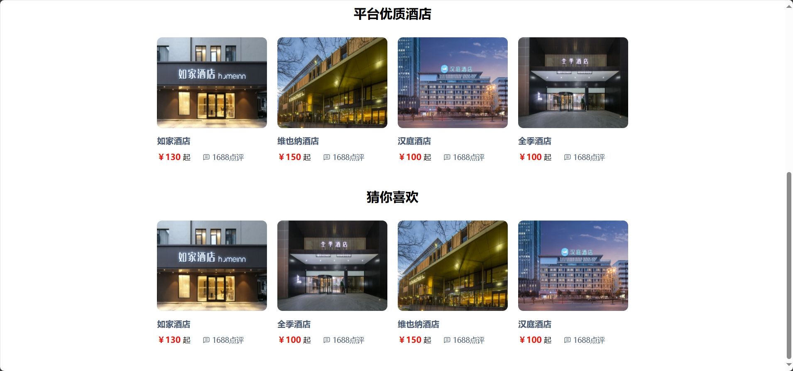

<h1 align="center">基于SSM的酒店管理及推荐系统（由评论+收藏+订单推荐）</h1>

<h4> 完整代码获取地址：从戎源码网（https://armycodes.com/） </h4>
<h4> 作者微信：19941326836 QQ：605739993 QQ群：655392706 </h4>
<h4> 承接计算机毕设、Java毕业设计、Python毕业设计、深度学习、机器学习 </h4>
<h4> 选题+开题报告+任务书+程序定制+安装调试+论文+答辩ppt 一条龙服务 </h4>
<h4> 毕业设计所有选题地址：(https://github.com/Descartes007/allProject) </h4>

## 一、项目介绍

基于SSM的酒店管理及推荐系统（由评论+收藏+订单推荐）：前端 Vue、ElementUI，后端 SpringBoot、Mybatis，系统角色分为：管理员、员工和用户，管理员在管理后台管理酒店品类，对公告进行发布，添加新酒店房间信息，酒店订单进行管理，对入住进行登记等；酒店员工对房间进行分类，对客房信息进行更新，对入住进行登记和评论；用户根据酒店进行选择，根据由个人偏好生成的酒店列表选择酒店下单等。主要功能如下：

### 1、管理员：

- 基本操作：登录、修改密码、修改个人信息、上传图片、获取个人信息
- 房间分类管理：获取房间分类列表、筛选房间分类信息、删除房间分类信息、编辑房间分类信息、查看房间分类信息详情
- 客房信息管理：获取客房信息列表、筛选客房信息、删除客房信息、编辑客房信息、查看客房信息详情
- 订单管理：获取订单信息列表、筛选订单信息、删除订单信息、查看订单信息详情
- 入住登记管理：获取入住登记列表、查看入住登记详情、筛选入住登记信息、删除入住登记信息、退房
- 评论管理：获取评论列表、查看评论信息详情、删除评论信息
- 公告管理：获取公告列表、筛选公告信息、删除公告信息、发布公告、修改公告内容、删除公告信息
- 管理员管理：获取管理员列表、筛选管理员信息、修改管理员信息、删除管理员信息、添加管理员信息、查看管理员信息详情
- 酒店员工管理：获取酒店员工列表、筛选酒店员工信息、修改酒店员工信息、删除酒店员工信息、添加酒店员工信息、查看酒店员工信息详情
- 用户管理：获取用户列表、筛选用户信息、修改用户信息、删除用户信息、添加用户信息、查看用户信息详情

### 2、员工：

- 基本操作：登录、修改密码、修改个人信息、上传图片、获取个人信息、注册
- 房间分类管理：获取房间分类列表、筛选房间分类信息、删除房间分类信息、编辑房间分类信息、查看房间分类信息详情
- 客房信息管理：获取客房信息列表、筛选客房信息、删除客房信息、编辑客房信息、查看客房信息详情、新增客房信息
- 订单管理：获取订单信息列表、筛选订单信息、删除订单信息、查看订单信息详情
- 入住登记管理：获取入住登记列表、查看入住登记详情、筛选入住登记信息、删除入住登记信息、退房、入住登记
- 评论管理：获取评论列表、查看评论信息详情、删除评论信息

### 3、用户：

- 基本操作：登录、注册、修改个人信息、上传图片、获取个人信息、留言、回复留言、修改密码、收藏、注册
- 热门景点模块：获取景点列表、收藏景点信息、查看景点信息详情、评论景点、点赞、拉踩、筛选景点信息、购票
- 旅游路线模块：获取旅游路线列表、收藏旅游路线信息、查看旅游路线信息详情、评论旅游路线、筛选旅游路线信息
- 酒店模块：获取酒店列表、收藏酒店信息、查看酒店信息详情、评论酒店、筛选酒店信息、预订
- 机票模块：获取机票列表、查看机票信息详情、筛选机票信息、预订
- 交流模块：获取交流列表、筛选交流信息、发布帖子、评论帖子、删除帖子
- 资讯模块：获取资讯列表、筛选资讯信息、查看资讯详情
- 订单模块：获取订单列表、删除订单、下单、支付、查看订单详情、筛选订单信息

## 二、环境

- <b>IntelliJ IDEA 2020.3</b>

- <b>Mysql 5.7.26</b>

- <b>NodeJs 14.17.3</b>

- <b>Maven 3.6.3</b>

- <b>JDK 1.8</b>

## 三、运行截图

